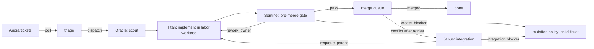

# Aegis

Aegis is a terminal-first, deterministic multi-agent orchestrator for software work.

It reads task truth from [Agora](packages/agora/README.md), records orchestration truth in `.aegis/`, runs scoped agents through replaceable runtime adapters (Claude Code, Codex, Pi), and lands work through a deterministic merge queue. Olympus, the operator console, visualizes and supervises those truth planes without replacing them.

`docs/AEGIS.md` is the canonical source of truth for product and architecture decisions.


## How It Works

Agents are free to inspect, reason, edit, and test inside their assigned scope. Aegis owns everything that must be deterministic: graph state, retry policy, merge routing, artifact acceptance, and completion.

```text
poll -> triage -> dispatch -> monitor -> reap
```



Every handoff is a typed artifact that Aegis validates before routing:

| Caste | Role | Artifact |
| --- | --- | --- |
| Oracle | Scouts scope, risks, and checks. Advisory only. | `.aegis/oracle/<issue>.json` |
| Titan | Implements and commits inside its labor worktree. | `.aegis/titan/<issue>.json` + git proof |
| Sentinel | Gates the candidate with typed findings. | `.aegis/sentinel/<issue>.json` |
| Janus | Resolves merge-boundary failures. | `.aegis/janus/<issue>.json` |

Titan output is checked against git: the candidate branch must advance, changed files must stay in scope, and the project root must stay clean. Findings route mechanically: in-scope defects rework the owner, out-of-scope needs become policy-created blocker tickets, and exhausted retries are reported instead of burning quota.

## Truth Planes

| Concern | Source |
| --- | --- |
| Task truth | `.agora/tickets.json`, `.agora/events.jsonl` |
| Orchestration truth | `.aegis/dispatch-state.json` |
| Merge truth | `.aegis/merge-queue.json` |
| Observability | `.aegis/logs/` (daemon, phases, live session streams), `.aegis/transcripts/`, caste artifact directories |
| Runtime execution | adapter sessions |

All durable state is written atomically (temp file + rename).

## Runtime Adapters

Set `runtime` in `.aegis/config.json`.

| Runtime | Engine | Artifact hand-off | Requirements |
| --- | --- | --- | --- |
| `claude` | Claude Code headless (`claude -p --output-format stream-json`) | schema-validated structured output (`--json-schema`) | `claude` CLI signed in; models `anthropic:<model-id>` |
| `codex` | `codex exec --json` | final JSON text | `codex` CLI signed in |
| `pi` | in-process Pi coding agent | typed `emit_*` tool calls | Pi provider settings (`.pi/settings.json`) |
| `scripted` | deterministic seam runtime; fakes agent work | JSON | none (tests and mock proof only) |

Every adapter streams live activity (tool calls, errors, messages) to `.aegis/logs/session-streams/`; the monitor kills sessions that go idle, not sessions that run long.

See [Runtime adapters](docs/runtime-adapters.md) for tool policies, environment overrides, and the adapter contract.

## Quick Start

Requires Node.js 22.12+ and git.

```bash
npm install
npm run build
```

In the repository you want Aegis to work on:

```bash
node /path/to/aegis/dist/index.js init --runtime claude   # creates .aegis/ and ignore rules
node /path/to/aegis/packages/agora/dist/cli.js create --title "Add dark mode" --kind task --column ready --actor human --json
node /path/to/aegis/dist/index.js start                   # runs the daemon
node /path/to/aegis/dist/index.js stream                  # in another terminal: watch agents work
```

### Using Claude Code

```bash
npm install -g @anthropic-ai/claude-code
claude          # sign in once
```

`aegis init --runtime claude` writes this config; to switch an existing project, set the runtime and models in `.aegis/config.json`:

```json
{
  "runtime": "claude",
  "models": {
    "oracle": "anthropic:claude-opus-5-5",
    "titan": "anthropic:claude-opus-5-5",
    "sentinel": "anthropic:claude-opus-5-5",
    "janus": "anthropic:claude-opus-5-5"
  }
}
```

`aegis start` preflight checks that the CLI runs and the model refs are well formed. Each caste's `thinking` level maps to Claude Code effort, and final artifacts are validated against the caste schema before Aegis parses them.

## CLI

```text
aegis init [--runtime <name>]  Create .aegis/ state files and ignore rules
aegis start                 Run the daemon
aegis stop                  Stop the daemon and release active sessions
aegis status                Daemon, live sessions, stages, merge queue, failures (JSON)
aegis stream [daemon]       Follow daemon, phase, and live session activity
aegis poll|dispatch|monitor|reap
aegis scout|implement|review|process <issue>
aegis merge next
aegis help
```

Direct commands are routed to a running daemon so they never race it over `.aegis` state. See the [usage guide](docs/usage.md).

## Olympus

```bash
npm run olympus:dev    # http://127.0.0.1:4173/
```

Olympus shows the Agora board, live session terminals, the Aether live swarm map (tickets flying between caste stations, handoffs as packets, a live signal feed), records and artifacts, and validated config editing, in light and dark themes. Keys `1`-`5` switch views. Its design system (semantic tokens, Radix-based primitives, and Aegis compositions such as status and caste badges) has a living gallery at `/design.html`. See [Olympus](docs/olympus.md).

| Sessions | Records |
| --- | --- |
|  |  |

## Seeded Proof

The Step 1 product gate is a real adapter draining the seeded animated React todo graph into a working app. Seeding stays command-only:

```bash
AEGIS_MOCK_RUN_RUNTIME=claude npm run mock:seed
npm run mock:run -- node dist/index.js start
npm run mock:acceptance
```

## Development

```bash
npm run lint          # typecheck src, tests, and Agora
npm test              # deterministic seam tests (unit + integration)
npm run test:acceptance
npm run build
npm run olympus:build
npm run olympus:screenshots   # regenerate docs/screenshots (after npm run build)
```

Project layout:

```text
src/
  cli/          terminal commands, daemon lifecycle, direct-command routing
  config/       config schema, defaults, validation, init
  core/         poller, triage, dispatcher, monitor, reaper, loop runner, policies
  core/caste/   caste runners, prompts, artifact readers, recovery
  castes/       typed artifact parsers, shared artifact schemas, Pi tool contracts
  runtime/      adapter contract, registry, Claude/Codex/Pi/scripted adapters, session streams
  merge/        merge queue state, tier policy, merge executor
  tracker/      generic tracker boundary + Agora client
  labor/        git worktree labors
  shared/       atomic writes, JSON, git, file scope helpers
  mock-run/     seeded React todo proof
olympus/        operator console: React views, design system (src/components/), local API (server/), screenshot script
packages/agora/ embedded Agora ticket board
```

## Documentation

- [Canonical source of truth](docs/AEGIS.md)
- [Overview](docs/overview.md)
- [Modules and truth planes](docs/modules.md)
- [Control loop and decisions](docs/control-loop.md)
- [Runtime adapters](docs/runtime-adapters.md)
- [Configuration](docs/configuration.md)
- [Usage guide](docs/usage.md)
- [Olympus operator console](docs/olympus.md)
- [Screenshots](docs/screenshots.md)

## License

MIT
