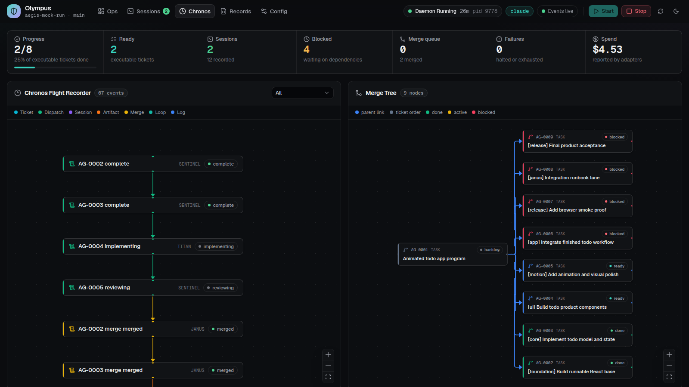

# Olympus Operator Console

Olympus is the local Aegis operator console. It reads Aegis truth planes and exposes deterministic controls through a local API that runs inside the Vite dev server (`olympus/server/`).

Olympus is not a separate orchestration truth plane. Terminal commands and `.aegis` state remain authoritative.

## Start

```bash
npm run olympus:dev
```

Open `http://127.0.0.1:4173/`. Select a workspace (an initialized Aegis project) from the Ops view; the choice is remembered in `.aegis/olympus-state.json` of the checkout running Olympus.

## Layout

- **Top bar**: workspace and branch, view navigation, daemon status (live indicator, uptime, pid), adapter, event-stream health, config gap badges, Start/Stop, refresh, and the theme toggle. Hover the daemon chip for the latest loop event. Start stays disabled until config is complete and saved.
- **KPI strip**: executable-ticket progress, ready work, active sessions, blocked tickets, pending merge candidates, failures, and adapter-reported spend when available.
- **Views**: Ops, Sessions, Chronos, Records, Config. Press `1`-`5` to switch; nav items show live counts (running sessions, failures, config gaps).
- **Theme**: system, light, or dark, cycled from the top bar and remembered per browser (`olympus.theme` in local storage). The saved theme is applied before first paint.

## Ops

Workspace selection, the next recommended operator action, and the Agora board. Drag tickets between columns or use Move; runtime-owned tickets are locked and show the caste and stage that owns them. Daemon phase events, run health, and live logs sit in a collapsible section below the board.


## Sessions

Agent sessions grouped by caste and filterable by caste. The selected session renders in a terminal: timestamps show as local clock time and activity tags are colored (tool calls, tool errors, assistant text, results). Running sessions stream live adapter activity from `.aegis/logs/session-streams/`; finished sessions show the durable transcript. The inspector lists the session id, adapter and model, usage (cost, tokens, turns), working directory, transcript path, and file scope. Sessions are linkable via `#agents/<session-id>`.


## Chronos

The flight recorder: event order across tickets, dispatch, sessions, artifacts, merges, phases, and logs, filterable by lane, beside the Agora merge tree (parent links, ticket order, and status per node). Select a node to expand its detail. Both canvases follow the active theme.



## Records

- **Attention**: operational failures, cooldowns, rework, merge failures, and rejected artifacts.
- **Dispatch Progress**: one row per issue with operator status, stage, owning caste, note, file scope, and artifact reference count. Status reads the dispatch record in order: failed, blocked, succeeded, reworking (Titan addressing review feedback), running, cooldown, queued for merge, pending.
- **Merge Queue**: queue items with state, tier, attempts, and failure reason.
- **Artifacts**: caste, policy, and transcript records; select one to inspect its JSON.
- **Logs**: the daemon log tail.


## Config

Edits `.aegis/config.json`, grouped into Runtime, Concurrency, Thresholds, Janus, Paths, and Adapter. Runtime pairs each caste's model (a searchable list from the selected adapter: the Claude Code model list, the local Codex model cache, or the Pi model registry) with its thinking level. Fields are validated as you type with the same rules the daemon uses; invalid or missing fields are flagged per section and block saving, and the server validates again before writing. Adapter-specific environment overrides (Claude, Pi) appear under Adapter and are passed to the daemon when Olympus starts it. Reset reloads the file from disk.


## Design System

Olympus ships its own small design system; there is no third-party component kit.

| Layer | Location | Contents |
| --- | --- | --- |
| Tokens | `olympus/src/styles.css` | Semantic OKLCH colors (`background`, `surface`, `surface-raised`, `surface-sunken`, `muted`, `border`, `primary`, `success`, `warning`, `danger`, `info`, `violet`, `terminal`), radii, elevation, and motion, mapped into Tailwind v4 with `@theme inline`. Dark is the default; `[data-theme="light"]` overrides the same tokens. |
| Primitives | `olympus/src/components/ui/` | Button, Badge, CountBadge, Card, Input, Textarea, NumberInput, Field, Select, Combobox, Dialog, Tabs, Segmented, Tooltip, CollapsibleSection, Alert, Progress, Toast, Kbd, Code, CodeBlock, Skeleton, Separator. Interactive parts are built on headless Radix primitives (focus management, keyboard support, ARIA) and `cmdk`; variants use `class-variance-authority`. |
| Aegis compositions | `olympus/src/components/aegis.jsx` | StatusBadge (maps any Aegis status onto a tone), caste identity (icon and hue per Oracle, Titan, Sentinel, Janus), LiveDot, SectionCard, StatBar and Stat, EmptyState, FactList, and cost, token, and clock formatters. |

Rules for new UI:

- Use tokens through Tailwind classes (`bg-surface`, `text-muted-foreground`, `border-border`); never hard-code colors, so both themes keep working. Chronos node colors are the one exception (`chronosColors` in `chronosGraph.js`), chosen to read on both themes.
- Geist is the interface font and Geist Mono is for ids, paths, numbers, and terminals (bundled through Fontsource; no network fonts).
- Icon-only buttons carry an `aria-label` and a tooltip. Failures announce with `role="alert"`, successes with `role="status"`.
- Animations respect `prefers-reduced-motion`.

The living gallery renders every token, primitive, and Aegis composition in both themes:

```bash
npm run olympus:dev    # then open http://127.0.0.1:4173/design.html
```


## Screenshots

`npm run olympus:screenshots` regenerates `docs/screenshots/`. It seeds the real todo proof graph into a temporary workspace, overlays a mid-run Claude Code state (finished and running sessions, live session streams, a failed Sentinel verdict, merged queue items) using the Aegis state writers, serves Olympus against it, and captures every view plus the gallery with headless Chromium. Run `npm run build` first. See [screenshots](screenshots.md) for options.

## Efficiency

The event stream rebuilds a snapshot every 1.5 s but only sends it when something changed. JSON files are re-parsed only when their size or mtime changes, directory listings are cached until the directory changes, and log tails read only the end of the file. Views load lazily, so the terminal and graph libraries download only when Sessions or Chronos opens.

## Control Boundaries

Olympus can supervise and route supported commands (start, stop, ticket create and move, config save), but proof setup stays terminal-first. In particular, seeded mock graph setup remains command-only.
