# Screenshots

1600x900 captures of Olympus at `http://127.0.0.1:4173/`, supervising the seeded animated React todo graph mid-run with the Claude Code adapter: foundation and core merged, a Titan implementing the UI lane, and a Sentinel re-reviewing the motion lane after a failed verdict. Dark is the default theme; every view also has a light capture.

## Ops

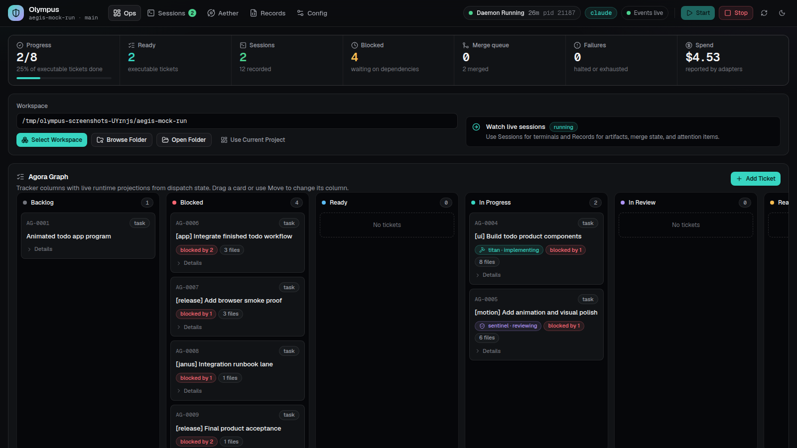

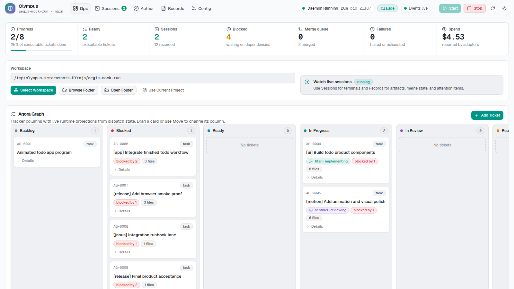

## Sessions

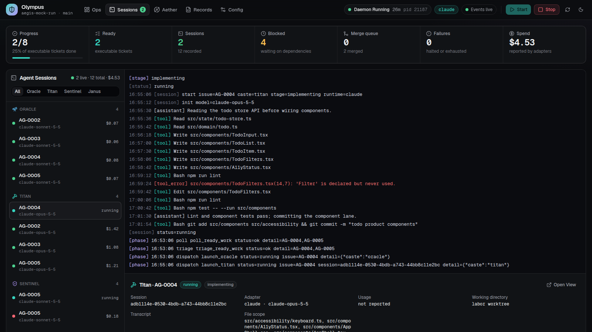

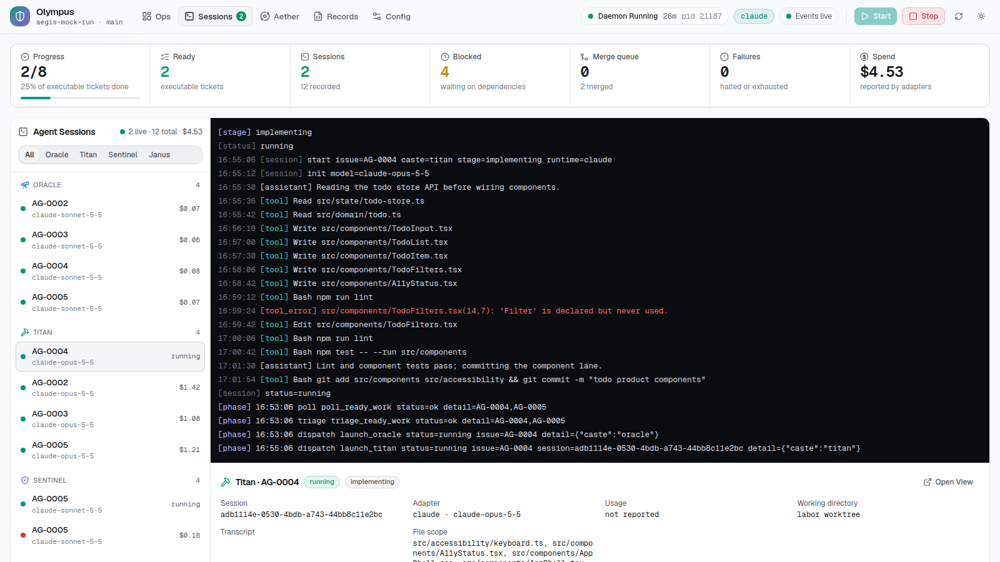

## Aether

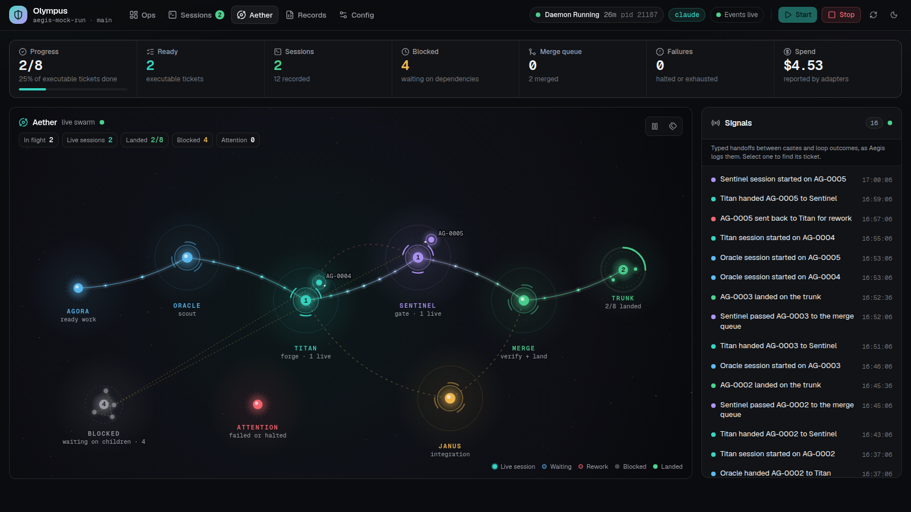

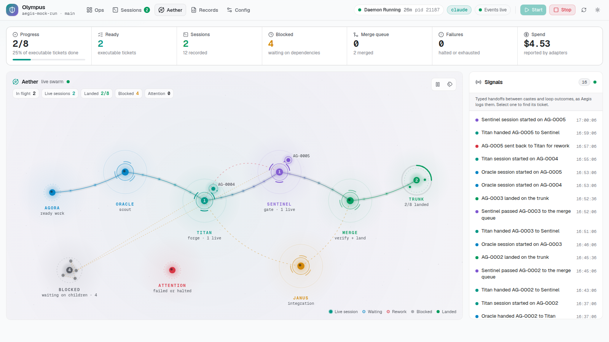

## Records

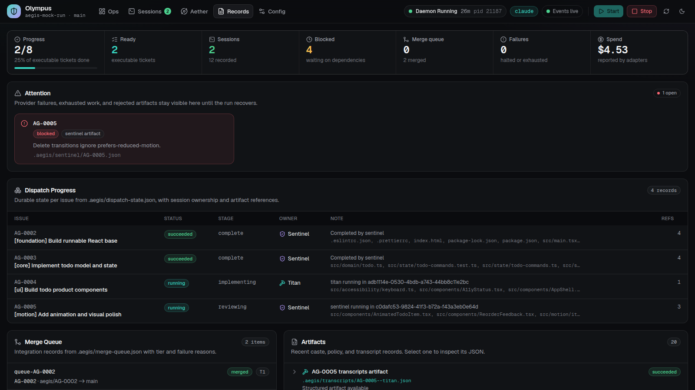

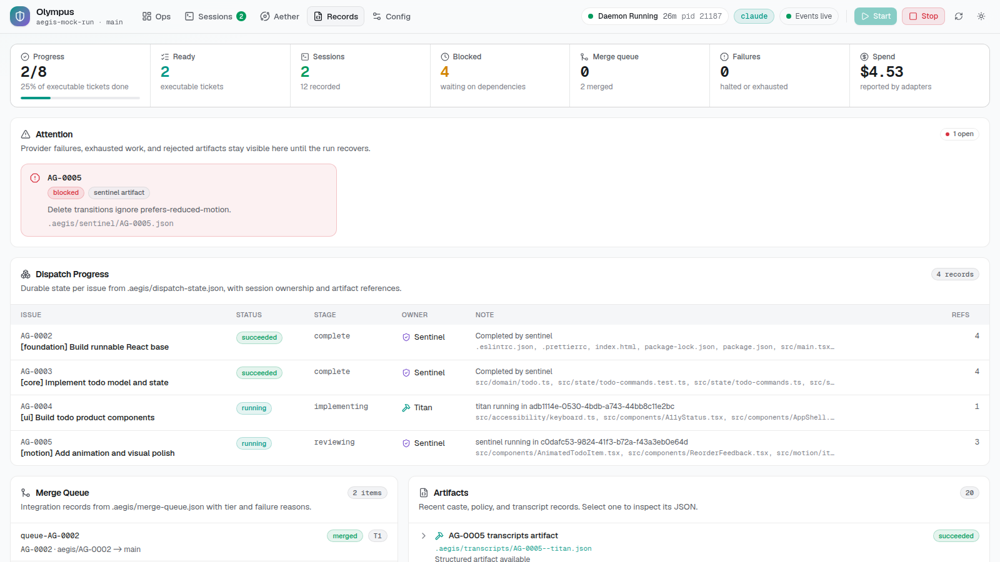

## Config

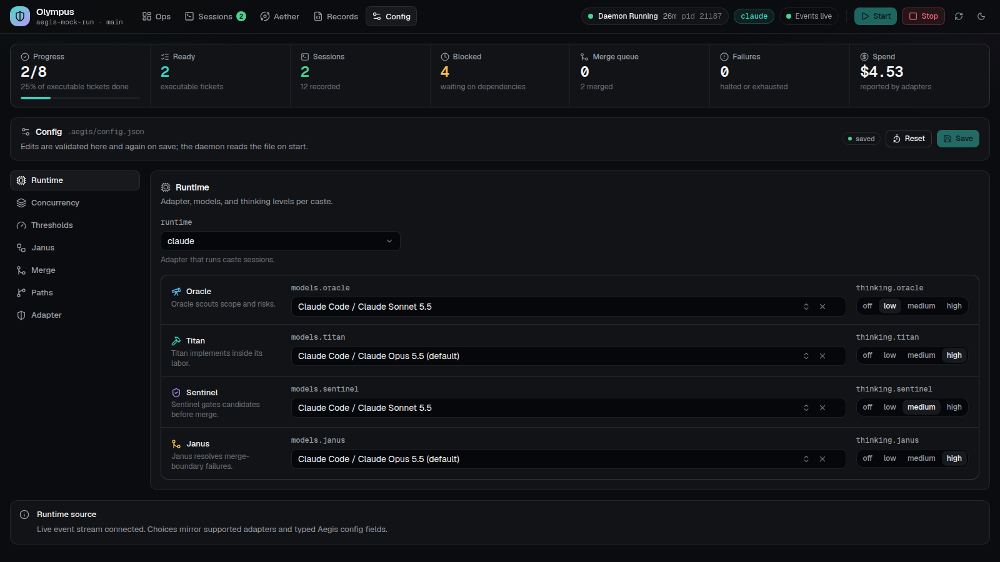

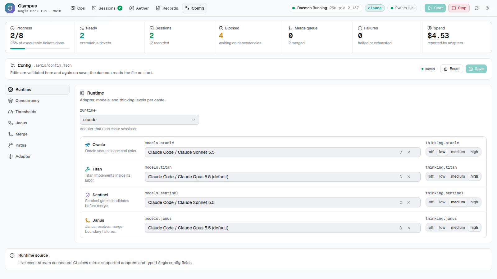

## Design System Gallery

Served at `/design.html`; see [Olympus design system](olympus.md#design-system).

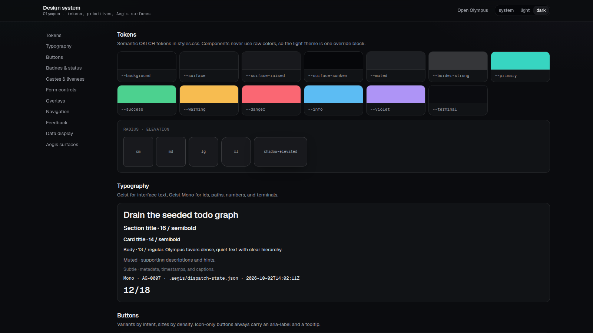

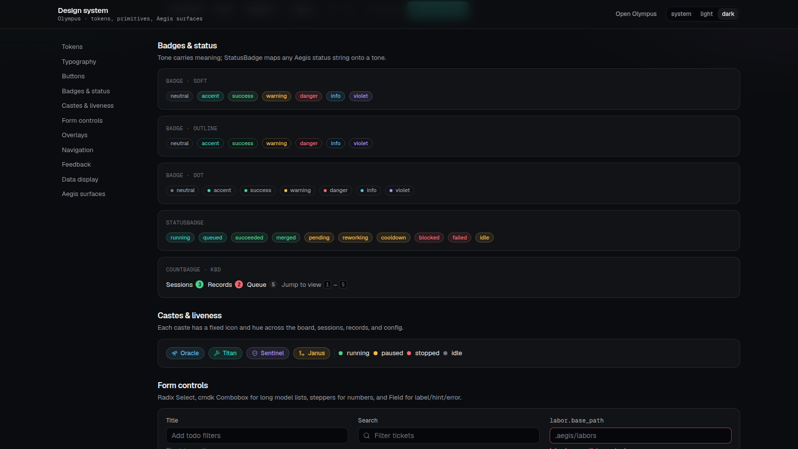

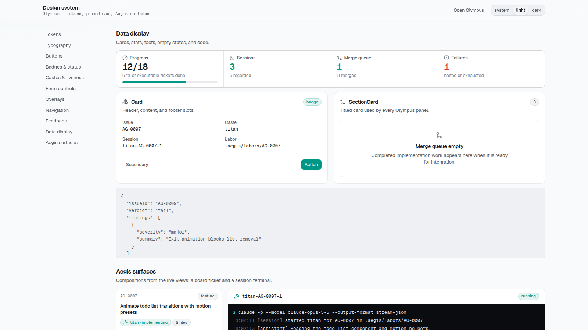

## Regenerating

```bash
npm run build
OLYMPUS_SCREENSHOT_THEMES=dark,light npm run olympus:screenshots
```

The script (`olympus/scripts/screenshots.mjs`) builds a sample workspace in a temporary directory with the real `mock:seed` graph and the Aegis state writers, starts Olympus against it on port 4183, and drives headless Chromium through `playwright-core`. No live adapter runs; the sample state is deterministic apart from timestamps.

| Variable | Default | Meaning |
| --- | --- | --- |
| `OLYMPUS_SCREENSHOT_THEMES` | `dark` | Comma-separated themes; non-dark themes get a `-<theme>` suffix. |
| `OLYMPUS_SCREENSHOT_DIR` | `docs/screenshots` | Output directory. |
| `OLYMPUS_SCREENSHOT_CHROMIUM` | Playwright's browser | Chromium executable to use instead of a Playwright-managed download. |
| `OLYMPUS_SCREENSHOT_PORT` | `4183` | Port for the temporary Olympus server. |
| `OLYMPUS_SCREENSHOT_KEEP` | unset | Keep the sample workspace and print its path. |
